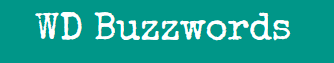
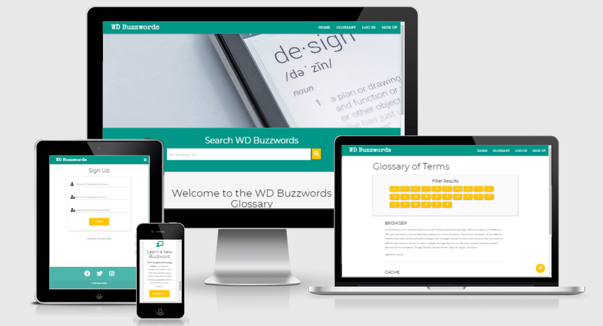
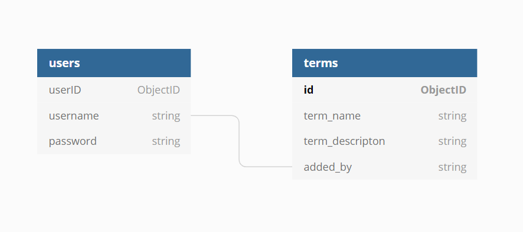
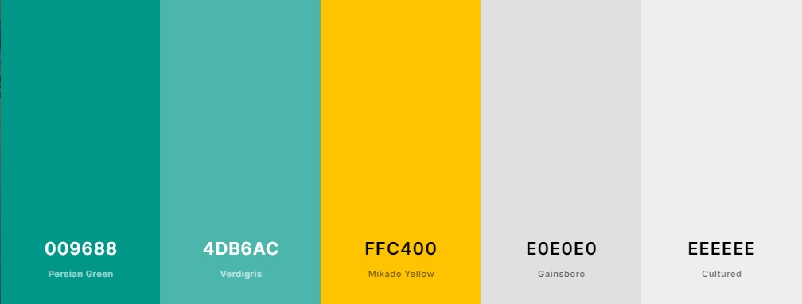

# ****
___
___


WD Buzzwords is a crowdsourced dictionary where users can look up explanations to some of the most important terms and abbreviations they will come accross when working in web development. Members can also contribute to the dictionary to benefit others staring out in the industry. 

### :point_right: [Live demo](https://wd-buzzwords.herokuapp.com/)

## Table of Contents
___
  * [UX](#ux)
    + [User Stories](#user-stories)
    + [Scope](#scope)
    + [Structure](#structure)
    + [Wireframing](#wireframing)
    + [Design Choices](#design-choices)
  * [Technologies Used](#technologies-used)
    + [Languages](#languages)
    + [Frameworks, Libraries and Tools](#frameworks--libraries-and-tools)
  * [Features](#features)
    + [Implemented Features](#implemented-features)
    + [Future Features](#future-features)
  * [Testing](#testing)
  * [Deployment](#deployment)
  * [Credits](#credits)
  * [Acknowledgements](#acknowledgements)


## UX
___
**Project Goals**
* To create an easy to access platform which contains key web development buzzwords, ranging from most basic to the more technical.
* To provide users with an introduction to the most common terms in web development with clear and comprehensive definitions. 
* To allow users to quickly look up words in the dictionary and for registered users to add new terms as well as modify and delete their previous entries. 

### User Stories

- [x] **Guest user**
* As a guest user of WD Buzzwords, who is visiting the site for the first time, I want to understand easily what the site is about.
* As a guest user of WD Buzzwords, I want to browse web development terms and jargons and look up meanings without needing to register to the website. 
* As a guest user of WD Buzzwords, I want to be able to easily access all available website features from different screen size devices.
* As a guest user of WD Buzzwords, I want to be able to use the searchbox to search for terms that I would like to find out more about.
* As a guest user of WD Buzzwords, I want to be able to filter terms alphabetically using the alphabet filter buttons. 
* As a guest user of WD Buzzwords, I want to be able to easily register to the website.

- [x] **Registered user**
* As a registered user of WD Buzzwords, I want to be able to log in to the website using my username and password. 
* As a registered user of WD Buzzwords, I want to be able to contribute to the dictionary by adding new terms and their description.
* As a registered user of WD Buzzwords, I want to be able to update the entries contributed by myself if need be.
* As a registered user of WD Buzzwords, I want to be able to view all my added entries in my Account page.
* As a registered user of WD Buzzwords, I want to be able to delete the entries contributed by myself if necessary.
* As a registered user of WD Buzzwords, I want to be able to confirm deletion before deleting my entries.

- [x] **Site owner / admin**
* As a site owner of WD Buzzwords, I want to be able to monitor and regularly update the website.
* As a site owner of WD Buzzwords, I want to be able to delete entries contributed by registered users if necessary.


[back to top](#wd-buzzwords)

### Scope
* To create a user friendly website using HTML, CSS, JavaScript, Python, Flask and MongoDB that ensures continuous, intuitive and fluid experience for the users. 
* To provide a learning aid that promotes understanding of web development terms and abbreviations and stimulates a desire to learn independently.
                                                                                              
### Structure
This website offers users the option to choose between the following two to accomodate their individual preferences:
* **Guest users** - (unauthenticated site visitors) can access selected functions in the navigation panel: Home, Glossary, Log In and Sign Up Pages.
* **Registered users** - once users decide to register to the website, they will be able to access full functionality and additionally access Account, Add Term and Log Out pages. 


### Wireframing
- [x] **[Desktop wireframes](static/docs/desktop-wf.pdf)**
- [x] **[Tablet and Mobile wireframes](static/docs/tablet-wf.pdf)**

Some changes were made to the original wireframes during development process for better user experience. 
* I decided to move the _Search Box_ to the Home Page, to improve the UX for the users who don't have the time to sign up to the website or just want to look up a term. The Home Page has more content now and is scrollable, compared to the original one-page design.
* The Glossary Page _Filter Results_ box was replaced by _Filter Results by Letters_ section and now features buttons with all the letters of the alphabet. I thought this will will be a useful feature to have as more terms will be added and dictionary expands in the future.
* I also added 404 'Page Not Found' and 500 'Internal Server Error' pages, which were not in wireframes, to communicate to users what was the reason the page didn't render correctly and give instructions on what to do next. 
- [x] **Database Diagram**
* The diagram below shows the relationship between fields of the existing database collections. I kept it simple as I wanted it to be compact and serve it's purpose of introducing a term and it's description. 




### Design Choices
- [x] **Color Scheme**
* The color palette was created using [Coolors](https://coolors.co/4db6ac-ffc400-c2185b-e0e0e0-eeeeee) and materialize color classes were used in this project.
* I chose a base color of teal and a complimentary color orange to create contrast to the site and add depth. By using this bold combination, I aimed to create an inviting and relaxing design for the users. Light grey was used to display the flash messages. 


- [x] **Typography**
* Google Fonts *Special Elite* used to give a vintage style typewriter feel to the website logo.
* *Monserrat* used for headings to give the site less formal feel.
* *Average* for the all other elements as I found it complemented well the above two fonts. 

- [x] **Imagery**
* The Home page supporting image added to enchance the overall experience and was obtained from [Unsplash](https://unsplash.com/photos/T6fDN60bMWY).
* A chart in Add Term page was taken from [Macmillian Dictionary](https://www.macmillandictionary.com/open-dictionary/submit.html).

[back to top](#wd-buzzwords)

## Technologies Used
___
### Languages
* HTML5
* CSS3
* JavaScript
* Python

### Frameworks, Libraries and Tools
- [x] **Front-end**
* **[Materialize CSS v1.0.0](https://materializecss.com/)** - a front-end framework, used to create sleek, consistent, functional and responsive website. I wanted to familiarize myself better with Materialize as my previous two projects used Bootstrap. 
The main components used: navbar, sidenav, parallax, cards, modal, footer, etc.  
* **[jQuery](https://jquery.com/)** - required to ensure proper rendering of the Materialize components listed above.
* **[Google Fonts](https://fonts.google.com/)** for typography. 
* **[Font Awesome v5.15.3](https://fontawesome.com/icons?d=gallery&p=2)** for icons in icons section, social icons and some of the buttons.
* **[Tinypng.com](https://tinypng.com/)** - to reduce size and compress the images used in this project.
* **[RandomKeygen](https://randomkeygen.com/)** - to create Fort Knox Password.
* **[Balsamiq](https://balsamiq.com/wireframes/desktop/)** - to generate digital sketches for the project concept for better planning of the layout of the website.
* **[Markdown-toc](http://ecotrust-canada.github.io/markdown-toc)** - to generate the Table of contents.


- [x] **Back-end**
* **[Flask](https://flask.palletsprojects.com/en/1.1.x/)** - a lightweight micro web framework written in Python used to create a simple, clean code and to reduce development time.
* **[MongoDB](https://www.mongodb.com/2)** - non-relational database, used to store, manipulate and retrieve data.
* **[Werkzeug](https://werkzeug.palletsprojects.com/en/1.0.x/)** - used with Flask to securely store passwords with salted hashes and verify user passwords to authenticate users.
* **[Flask Jinja](https://flask.palletsprojects.com/en/1.1.x/templating/)** - used as it's a part of a Flask package and to allow template inheritance.


- [x] **Deployment**
* **Git** - used to keep track of the changes made to the repository and for version control.
* **Gitpod** - I used CI full template as an IDE to develop, commit and push files to GitHub. 
* **GitHub** - used as a hosting service and for future collaborations.
* **Heroku** - my GitHub repo for this project had been connected to Heroku app to enable management and deployment of this app.

[back to top](#wd-buzzwords)

## Features
___

### Implemented Features

- [x] **Features available to all users and admin**

**Home Page**

* **Navigation Bar**
  * Responsive Navigation Bar was created using Materialize Navbar-extended class. It displays the website's logo on the left and on the right navigation links to the "Home", "Glossary", "Log In" and "Sign Up" Pages when the user is not logged in. 
  * Brand Logo also serves as link to the Home Page, which is particularly convenient when accessing the site on smaller screen size devices. 
  * On screen sizes below 992px navbar is hidden and slide out menu comes into effect, which collapses into a hamburger menu bar when closed. 

* **Parallax**
  * A Materialize parallax image was added to visually support the content and for added user interactivity.  

* **Search WD Buzzwords**
  * The Search box features an input field and a Search button, allows users to look up the terms and jargons they would like to learn more about. 
  * If the term exists in the dictionary, the search result is displayed in the Glossary page. Otherwise, users see a message "No matching results found". 

* **Welcome Section**
  * This section consists of a title and a paragraph text that explains the purpose of the website. 

* **Icon Boxes Section**
  * This section is made of two Materialize card-panels with added Font Awesome Icons and call to action buttons. The first panel invites users to sign-up to the website and the second one guides users to the Glossary Page to browse all terms. 
  * The bottom part of the section is for users who would like to purchase a Glossary in a book form and includes a link to an external third-party site that opens up in a new tab. 

* **Footer**
  * Designed using Materialize Sticky Footer component, it's responsive and always stays on the bottom of the page unless there is a lot of content, when it gets pushed down. Contains hoverable Social Media icons to let users know they are clickable. Icons are linked to the external websites and open in new tabs when clicked. Available accross all pages.
  * Copyright section is directly below the Footer and contains Copyright information.

**Glossary Page**

* **Browse All Results**
  * By default, the Glossary page displays all terms in the dictionary sorted in alphabetical order allowing all users to scroll down to browse. A Materialize Floating Action Button has been added to create a shortcut button, so users can easily navigate back to the top of the page from any part of the page. 

* **Filter Results Section**
  * Located on top of the page, it helps users to narrow down the results by clicking on the buttons with the letter they require. This will be particularly useful as the site expands and more definitions will be added. 

**Log In Page**
* Contains a Materialize card with the required input fields for Username and Password. It allows registered users to log in to the account and to access additional features. 
* The page also contains a link to the Sign Up page. 

**Sign Up**
* Similar to the page above it contains a card with the Username, Password and Confirm password input fields and enables new users to create a personalized account and to be able to contribute to the dictionary. 
* There is a link below the card to re-direct already registered users to the Log In page. 


- [x] **Features available to registered users and admin**

**CRUD Functionality**

**Add Term**
* The form allows users to add new entries (Create functionality) and their description. It features a check-before-adding chart to help users to decide whether to add their word to the dictionary.
* If users try to add a term that already exists in the dictionary, they get a flash notification. If entries are unique, they are added to the dictionary and users see a flash message to confirm the successful entry. This entry is then displayed in the users' Account Page. 

**Account Page**
* The Account page displays the entries made by the user (Read functionality). 
* Materialize buttons are placed below each entry, providing an option to edit (Update functionality) or delete the term (Delete functionality). If delete button is clicked, users see a pop-up delete confirmation modal to eliminate accidental removal of entries.
* Admin user has the highest level of access to the website and an authorisation to delete entries made by other users, if they are deemed  irrelevant or inapropriate.

**Log Out**
* Enables users to log out of their account and deletes their session cookies. 

### Future Features 
* Add an _autocomplete_ attribute to the search box input field to allow the search form to predict terms and display options to fill in the field.
* Expand the glossary by adding _part of speech_, _synonyms_ and _pronunciation_ features. 
* Allow users to edit their passwords and delete their accounts. 
 
[back to top](#wd-buzzwords)

## Testing
___

You can find the testing documentation [HERE](TESTING.md)

### Issues and Solutions
* In the Search form, I initially used ```label for = " "``` to hint the value of the input field to the users but couldn't align it vertically within the box using Materialize classes and CSS. It was placed underneath the input field. After trying few things, I replaced it with ```placeholder = " "``` and it solved the issue. 
* When I tried to sort all the terms displayed in the Glossary Page in alphabetical order using ```sort()``` function, I noticed it was sorting first capitalized items and then again items beginning with lower case letters. I used ```upper()``` function in my ```insert_term``` functionality so all charachters on a string are converted to uppercase before being stored in the database. 
* During the tests, some of the buttons didn't render correctly on mobile devices on Safari and Mozilla. This was fixed by removing unnecessary ```type="submit"``` from the links styled as buttons where.


## Deployment
___
- [x] **Requirements:**
* **Python3** to write the code and run the application
* **PIP** to install packages
* **Git** for version control
* **GitPod** powered by VS Code was used for this project (any IDE of your choice will work)
* **MongoDB** - to create and manipulate the database
* **Heroku** - to deploy and manage the app


### Project Creation

* This project was created using the CI recommended [Gitpod Full Template](https://github.com/Code-Institute-Org/gitpod-full-template).
* Click on **_Use this template_** button and enter a short and memorable name of your choice for your repo and select **_Create repository from template_**. 
* Once created, click on green **_Gitpod_** button to open your new workspace. 

### Deployment to Heroku
Heroku cloud platform was used to deploy and host this app by following the steps below:

* **Set up workspace for Heroku:** 
    * In the terminal window of your IDE, create a requirements.txt file to contain all applications and dependencies required to run the app.

        ``` pip3 freeze --local . requirements.txt```
    * Create a Procfile (always with a capital P and no file extension!) - required by Heroku, to know which file runs the app.

        ``` echo web: python app.py > Procfile```

* **Create application in Heroku:**
    * Navigate to [Heroku](https://www.heroku.com/home) website and create an account.
    * Once logged in, click on the **_New_** button and select **_Create New App_**
    * Create a name for your app and select the region closest to your location.

* **Connect your app to GitHub repository:**
    * On the **_Deploy_** page, select GitHub as your **_Deplyment method_**.
    * You will then be prompted to find the github repository, click on **_Connect_** button to connect.
    * Click on the **_Settings_** tab and and select **_Config Vars_** and **_Reveal Config Vars_**.
    * Add the following variables (as stored in env.py):

    ```
    os.environ.setdefault("IP", "0.0.0.0")
    os.environ.setdefault("PORT", "5000")
    os.environ.setdefault("SECRET_KEY", "paste_your_secret_key_from_env.py")
    os.environ.setdefault("MONGO_URI", "obtained_from_your MongoDB_account")
    os.environ.setdefault("MONGO_DBNAME", "your_db_name")
    ```
    * In the IDE terminal, push the two new files to the GitHub repository:
    ```
    git add requirements.txt
    git commit -m "Add requirements.txt"        
    ```
    ``` 
    git add Procfile
    git commit -m "Add Procfile"
    git push
    ```
* Now go back to Heroku and click on **_Enable Automatic Deployment_** and **_Deploy Branch_**.
* The app is now connected and Heroku will receive the code from GitHub and automatically update whenever we push changes to the GitHub repository. You should be able to see "Your app was successfully deployed!". Click on **_View_** to launch your app.


### Clone the project
Steps required to **_Clone_** a repository from GitHub to your local machine:
* Navigate to the repository in GitHub.
* Click on the **_Code_** dropdown menu button.
* Click on **_Open with GitHub Desktop_** and follow the prompts to complete the cloning process.

### Fork the project
* To create a personal copy of this repository, click on **_Fork_** button on the top right corner of the repository page in GitHub.


### Run Locally
To run this project on your device using the IDE of your choice follow these steps:
* Install the requirements by typing in your IDE: 

    ```pip3 install -r requirements.txt```
* Navigate to [MongoDB](https://www.mongodb.com)
    * Create an account and sign in. 
    * Click on **_Create New Cluster_** and then **_+ Create Database_** to create a database.
    * Create **terms** and **users** collections in the database as shown below:

    **_terms_**
    ```
    _id: <ObjectId>
    term_name:<string>
    term_description:<string>
    added_by:<string>
    ```
    **_users_**
    ```
    _id: <ObjectId>
    username:<string>
    password:<string>
    ```

* In your IDE terminal, create the environment variables:   
    * Type ```touch env.py``` 
    in the terminal to create the file in the root directory. This file is used to store sensitive data (see environment variables above) and should never be pushed to GitHub.
    * To ignore it, create .gitignore file by typing 

    ```touch .gitignore``` 

    and add env.py into this file.
* You can now run the app, just type in the IDE terminal: 

    ```python3 app.py```. 


[back to top](#wd-buzzwords)


## Credits
___

### Content
**_The glossary content was obtained from following websites:_**
* [CareerFoundry](https://careerfoundry.com/en/blog/web-development/50-web-development-buzzwords-that-all-new-programmers-should-learn/)
* [Wood Street Journal](https://www.woodst.com/web-design-development/70-web-design-and-development-terms-we-wish-you-knew-part-one/)
* [Cactus](https://www.castus.co.uk/blog/glossary-of-web-design-terminology/#technology%20&%20web%20development)
* A link to a glossary in a book form: [Web Development Glossary](https://meiert.com/en/blog/the-web-development-glossary/)


### Media 
* A parallax image was obtained from [Unsplash](https://unsplash.com/photos/T6fDN60bMWY)
* A new entry submission chart was taken from [Macmillian Dictionary](https://www.macmillandictionary.com/open-dictionary/submit.html) 
* Favicon icon was made by Freepik from [Flaticon](https://www.flaticon.com)


### Code
* The project was inspired by the CI Task Manager walkthrough project.
* The Home Page design was designed following recommendations by YouTube tutorial video by [Traversy Media](https://www.youtube.com/watch?v=MaP3vO-vEsg&t=2677s). 
It was modified and adapted to the site's needs. 
* Tim Nelson from Tutor Support suggested a for-loop for Filter Results buttons.
* Igor for his help with the Filter Results function.


## Acknowledgements
___
* I would like to thank my mentor Excellence Ilesanmi for his continuous support throughout this course, help and insights.
* A big thank you to all tutors from Tutor Support for always pointing me to the right direction.
* Thanks to the wonderful Slack community for inspiring me stay positive no matter how hard it gets!


[back to top](#wd-buzzwords)
